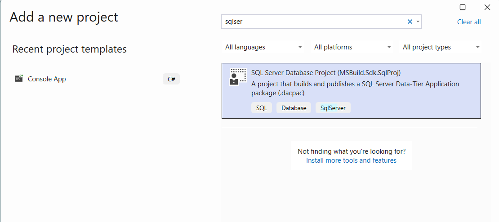
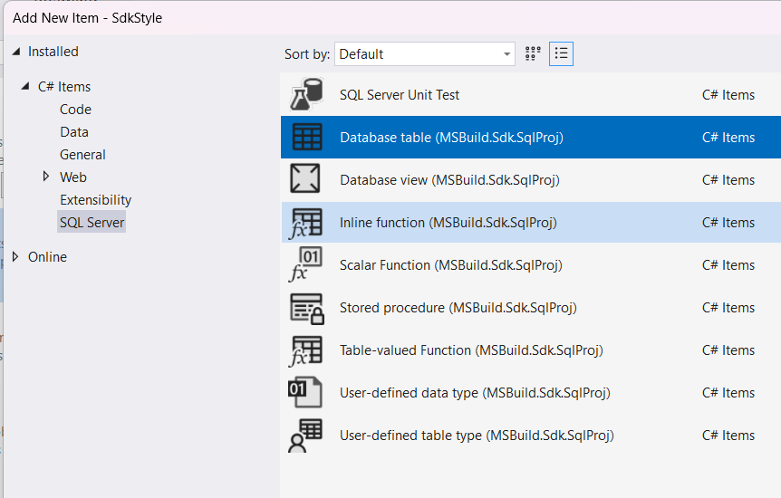
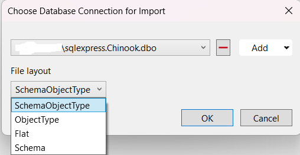
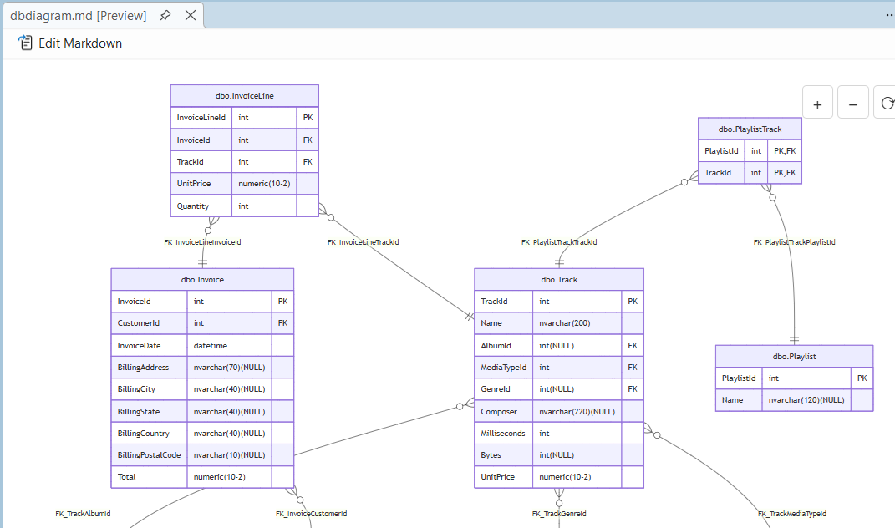
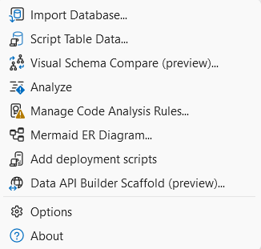

# Getting Started with SQL Database Project Power Tools

SQL Database Project Power Tools is a Visual Studio extension that makes working with SQL database projects easier and more productive. This guide will help you get started with the key features.

## What is SQL Database Project Power Tools?

SQL Database Project Power Tools enhances your Visual Studio experience when working with SQL Server database projects. It provides a collection of useful tools for importing databases, comparing schemas, analyzing code, creating diagrams, and more.

## Installation

You can install the extension in two ways:

1. **From Visual Studio**: Open Visual Studio, go to Extensions > Manage Extensions, search for "SQL Database Project Power Tools", and click Install.

2. **From the Visual Studio Marketplace**: Download and install from the [Visual Studio Marketplace](https://marketplace.visualstudio.com/items?itemName=ErikEJ.SQLProjectPowerTools).

After installation, restart Visual Studio to activate the extension.

## Creating a New SQL Database Project

SQL Database Project Power Tools adds project templates to make it easy to create new database projects.

1. In Visual Studio, select **File > New > Project**
2. Search for "SQL" in the project templates
3. Choose the **SQL Server Database Project** template
4. Name your project and choose a location
5. Click **Create**

You can also add new items to your project using the enhanced item templates:

## Importing a Database

One of the most useful features is the ability to import an existing database schema into your project. This saves you time by automatically generating all the necessary SQL scripts.

To import a database:

1. Right-click on your SQL database project in Solution Explorer
2. Select **SQL Project Power Tools > Import database**
3. Enter your database connection details
4. Choose which objects you want to import (tables, views, stored procedures, etc.)
5. Click **Import**

The tool will create all the necessary files in your project, organized by object type.

## Comparing Schemas

The schema compare feature helps you keep your database project in sync with your live databases. You can compare in both directions:

- Compare your project with a database to see what needs to be deployed
- Compare a database with your project to update your project files

To use schema compare:

1. Right-click on your SQL database project in Solution Explorer
2. Select **SQL Project Power Tools > Schema compare**
3. Choose your comparison source and target
4. Review the differences
5. Generate a script to apply the changes

This is especially useful when working in teams or managing multiple environments.

## Analyzing Your Code

Static code analysis helps you find potential issues in your database code before deployment. The analyze feature checks your SQL scripts against best practices and common pitfalls.

To analyze your project:

1. Right-click on your SQL database project in Solution Explorer
2. Select **SQL Project Power Tools > Analyze**
3. Review the analysis report
4. Address any issues found

The analysis includes checks for design issues, naming conventions, performance concerns, and more.

## Creating Entity/Relationship Diagrams

Visualizing your database structure is easy with the E/R diagram feature. This creates a Mermaid diagram showing the relationships between your tables.

To create a diagram:

1. Right-click on your SQL database project in Solution Explorer
2. Select **SQL Project Power Tools > Create Mermaid E/R diagram**
3. Choose which tables to include
4. The tool generates a Mermaid markdown diagram
5. View the diagram in any Mermaid-compatible viewer or documentation

These diagrams are perfect for documentation and help team members understand the database structure.

## Viewing .dacpac Files

The extension adds a Solution Explorer node for .dacpac files, making it easy to explore their contents without deploying them.

To view a .dacpac file:

1. Add a .dacpac file to your project
2. Expand the file in Solution Explorer
3. Browse through the database objects contained in the package

This is helpful when working with database packages from other projects or vendors.

## Scripting Table Data

When you need to include data in your database project, the Script Table Data feature generates INSERT statements for you.

To script table data:

1. Right-click on a table in your database project
2. Select **SQL Project Power Tools > Script Table Data**
3. Choose your data source and options
4. The tool generates INSERT statements for the table data
5. Add the generated script to your project

This is based on the popular [generate-sql-merge](https://github.com/dnlnln/generate-sql-merge) tool and supports various options for data scripting.

## Accessing the Tools

All SQL Database Project Power Tools features are accessible from the context menu in Solution Explorer:

Simply right-click on your SQL database project and look for the **SQL Project Power Tools** menu option.

## Power Pack Extension

For even more features, consider installing the [SQL Project Power Pack](https://marketplace.visualstudio.com/items?itemName=ErikEJ.SqlProjectPowerPack), which includes:

- **T-SQL Analyzer**: Real-time code analysis with over 140 rules
- **SQL Formatter**: Automatic code formatting with .editorconfig support

## Tips for Success

- **Start with Import**: If you have an existing database, use the import feature to get started quickly
- **Regular Schema Compares**: Keep your project and database in sync by comparing regularly
- **Use Analysis**: Run the analyzer before deploying to catch issues early
- **Document with Diagrams**: Create E/R diagrams to help your team understand the database structure
- **Version Control**: Keep your database project in source control to track changes over time

## Getting Help

If you need help or want to learn more:

- Review the [user guide](https://github.com/rr-wfm/MSBuild.Sdk.SqlProj/blob/master/README.md) for advanced topics
- Report issues or request features on [GitHub](https://github.com/ErikEJ/SqlProjectPowerTools)
- Rate the extension on the [Visual Studio Marketplace](https://marketplace.visualstudio.com/items?itemName=ErikEJ.SQLProjectPowerTools)

## Next Steps

Now that you're familiar with the basics:

1. Create or import a database project
2. Explore the various features
3. Set up your development workflow
4. Share your feedback to help improve the tool

Happy database development!
