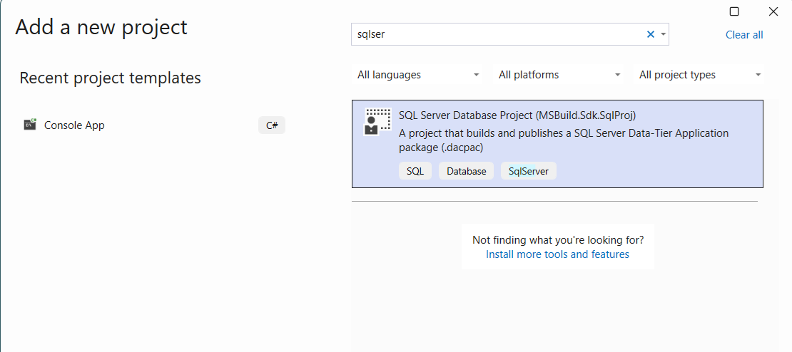
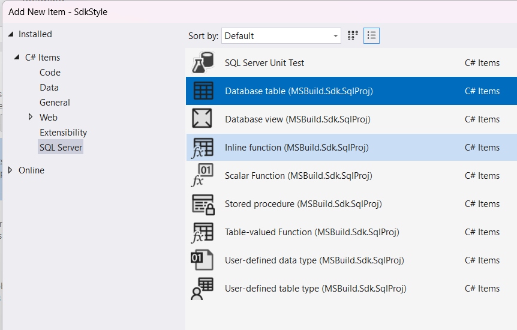
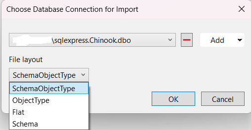
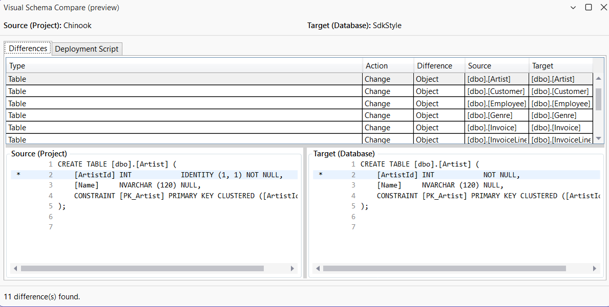
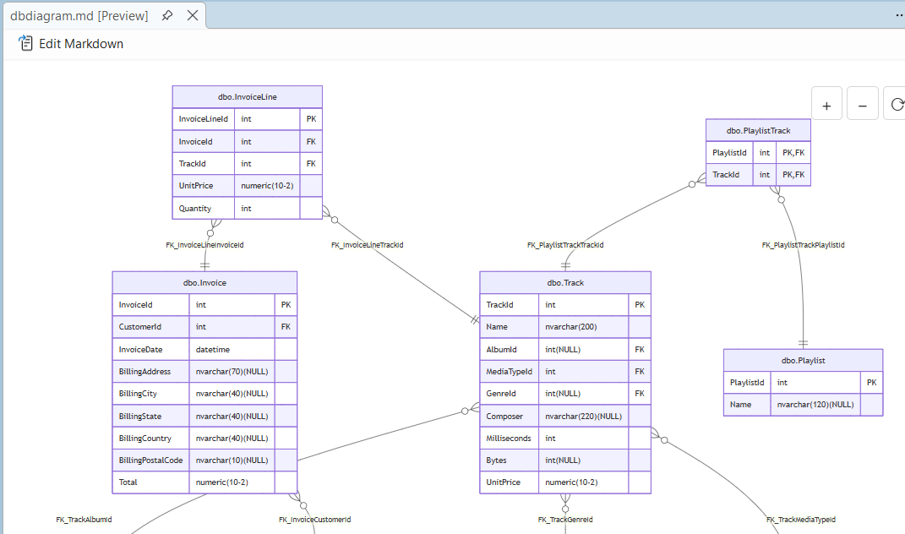
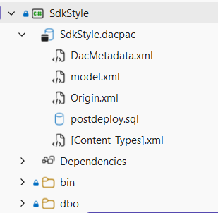
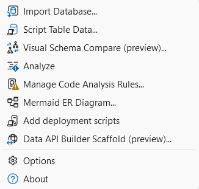

# Getting Started with SQL Database Project Power Tools

SQL Database Project Power Tools is a Visual Studio extension that makes working with SQL database projects easier and more productive. This guide will help you get started with the key features.

## What is SQL Database Project Power Tools?

SQL Database Project Power Tools enhances your Visual Studio experience when working with SQL Server database projects. It provides a collection of useful tools for importing databases, comparing schemas, creating diagrams, and more.

## Installation

You can install the extension in multiple ways:

1. **From Visual Studio**: Open Visual Studio, go to Extensions > Manage Extensions, search for "SQL Database Project Power Tools", and click Install.

2. **From the Visual Studio Marketplace**: Download and install from the [Visual Studio Marketplace](https://marketplace.visualstudio.com/items?itemName=ErikEJ.SQLProjectPowerTools).

3. **From VSIX Gallery (SSMS)** Download and install from [Open VSIX Gallery](https://www.vsixgallery.com/extension/SqlProjectsPowerTools.SSMS.D7DABDC8-FE46-4DA4-BED8-2EAF1A2A578D)

After installation, restart Visual Studio / SSMS to activate the extension.

## Creating a New SQL Database Project

SQL Database Project Power Tools adds project templates to make it easy to create new database projects. (Does not apply to SSMS)



1. In Visual Studio, select **File > New > Project**
2. Search for "SQL" in the project templates
3. Choose the **SQL Server Database Project** template
4. Name your project and choose a location
5. Click **Create**

You can also add new items to your project using the enhanced item templates:



## Importing a Database

One of the most useful features is the ability to import an existing database schema into your project. This saves you time by automatically generating all the necessary SQL scripts.



To import a database:

1. Right-click on your SQL database project in Solution Explorer
2. Select **SQL Project Power Tools > Import database**
3. Enter your database connection details
4. Choose the file layout for the imported objects
5. Click **Import**

The tool will create all the necessary files in your project, organized by object type.

## Comparing Schemas

The visual schema compare feature helps you keep your database project in sync with your live databases. You can compare in both directions:

- Compare your project with a database to see what needs to be deployed
- Compare a database with your project to update your project files



To use visual schema compare:

1. Right-click on your SQL database project in Solution Explorer
2. Select **SQL Project Power Tools > Visual Schema Compare (preview)...**
3. Choose your comparison source database and target direction
4. Review the differences in the visual schema compare tool window
5. Apply the changes as needed

This is especially useful when working in teams or managing multiple environments.

## Creating Entity/Relationship Diagrams

Visualizing your database structure is easy with the E/R diagram feature. This creates a Mermaid diagram showing the relationships between your tables.



To create a diagram:

1. Right-click on your SQL database project in Solution Explorer
2. Select **SQL Project Power Tools > Create Mermaid E/R diagram**
3. Choose which tables to include
4. The tool generates a Mermaid markdown diagram
5. View the diagram in Visual Studio or use it for documentation

These diagrams are perfect for documentation and help team members understand the database structure.

## Viewing .dacpac Files

The extension adds a Solution Explorer node for the output of your project (a .dacpac file), making it easy to explore their contents.



To view a .dacpac file:

1. Build your project
2. Expand the project in Solution Explorer
3. Browse through the xml files and postdeploy / predeploy scripts contained in the package

This is helpful when troubleshooting post and predeployment script issues.

## Scripting Table Data

When you need to include seed data in your database project, the Script Table Data feature generates INSERT statements for you.

To script table data:

1. Select **SQL Project Power Tools > Script Table Data**
2. Choose your data source and pick the table to script
3. The tool generates INSERT statements for the table data
4. The tool adds the generated script to your project in the `Post-Deployment` folder

This is based on the popular [generate-sql-merge](https://github.com/dnlnln/generate-sql-merge) script.

## Publishing Programmability Objects on Save (preview)

The **Publish programmability objects on save** feature automatically executes supported `CREATE` statements against a target database whenever you save a `.sql` file in your project. This gives you an inner-loop development experience where your stored procedures, views, functions, and triggers are kept in sync with your local database as you work.

Read more in the [blog post](https://erikej.github.io/dotnet/dacfx/sqlserver/visualstudio/ssms/2026/06/01/sqlprojects-dacfx.html).

**Supported object types:**

- Stored procedures (`CREATE PROCEDURE`)
- Views (`CREATE VIEW`)
- Functions (`CREATE FUNCTION`)
- Triggers (`CREATE TRIGGER`)

When the feature runs, `CREATE` statements are automatically rewritten as `CREATE OR ALTER` before being sent to the database, so the object is created if it does not yet exist or updated if it does.

### Setting up publish on save

1. Right-click on your SQL database project in Solution Explorer
2. Select **SQL Project Power Tools > Enable publish on save**
3. If no `.env` file exists in the project directory, a sample file is created automatically:

   ```
   AutoPublish=Server=localhost;Database=YourDatabase;Integrated Security=true;TrustServerCertificate=true;
   ```

4. Edit the `.env` file to point to your target database
5. Save any supported `.sql` file — the object is published immediately and a status message appears in the Visual Studio status bar

> **Note:** Add `.env` to your `.gitignore` so that connection strings are not committed to source control.

### Configuration

You can enable or disable the feature at any time via **Tools > Options > SQL Server Tools > SQL Project Power Tools** and toggling the **Publish programmability objects on save (preview)** option.

The `.env` file must be located in the root directory of your SQL database project and must contain a key named `AutoPublish` with the connection string value, for example:

```
AutoPublish=Server=localhost;Database=MyDb;Integrated Security=true;TrustServerCertificate=true;
```

### How it works

- When you save a `.sql` file that belongs to a SQL database project, the extension reads the file and parses the T-SQL.
- If the file contains only supported `CREATE` (or `CREATE OR ALTER`) statements (plus optional `SET ... ON/OFF` statements like `SET ANSI_NULLS ON`), the script is rewritten to use `CREATE OR ALTER` and executed against the database specified in the `.env` file.
- The status bar shows `Publish completed: <filename>` on success or `Publish failed: <filename>` if an error occurs.
- Files that contain unsupported statements (for example `CREATE TABLE`) are silently skipped.

## Accessing the Tools

All SQL Database Project Power Tools features are accessible from the context menu in Solution Explorer:



Simply right-click on your SQL database project and look for the **SQL Project Power Tools** menu option.

## Power Pack Extension (Visual Studio)

For even more features, consider installing the [SQL Project Power Pack](https://marketplace.visualstudio.com/items?itemName=ErikEJ.SqlProjectPowerPack), which includes:

- **T-SQL Analyzer**: Real-time code analysis with over 140 rules
- **SQL Formatter**: Automatic code formatting with .editorconfig support

## Tips for Success

- **Start with Import**: If you have an existing database, use the import feature to get started quickly
- **Regular Schema Compares**: Keep your project and database in sync by comparing regularly
- **Document with Diagrams**: Create E/R diagrams to help your team understand the database structure
- **Version Control**: Keep your database project in source control to track changes over time

## Getting Help

If you need help or want to learn more:

- Review the SDK [user guide](https://github.com/rr-wfm/MSBuild.Sdk.SqlProj/blob/master/README.md) for advanced topics
- Report issues or request features on [GitHub](https://github.com/ErikEJ/SqlProjectPowerTools)
- Rate the extension on the [Visual Studio Marketplace](https://marketplace.visualstudio.com/items?itemName=ErikEJ.SQLProjectPowerTools)

## Next Steps

Now that you're familiar with the basics:

1. Create or import a database project
2. Explore the various features
3. Set up your development workflow
4. Share your feedback to help improve the tool

Happy database development!
