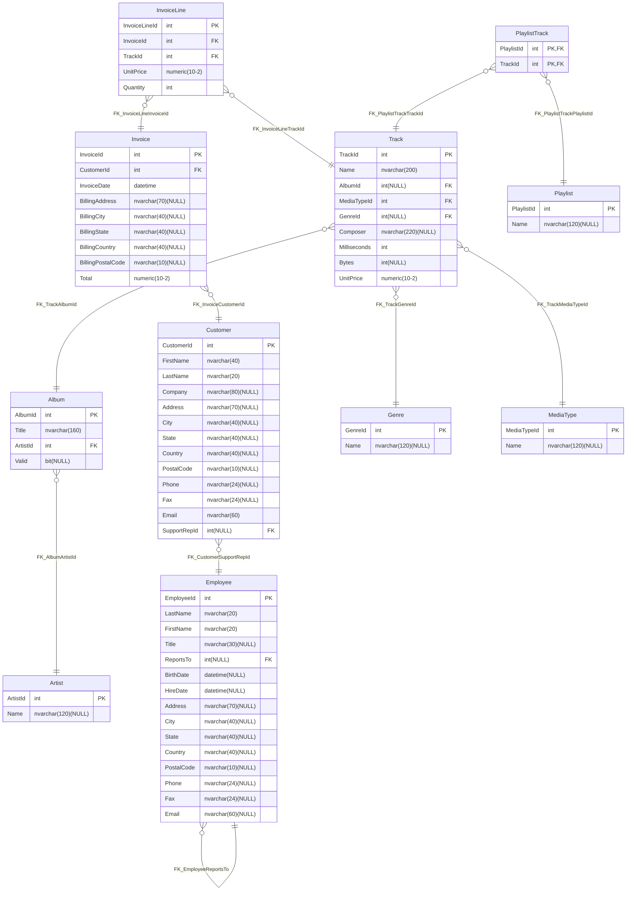

```mermaid
erDiagram
  Album {
    AlbumId int PK
    Title nvarchar(160) 
    ArtistId int FK
    Valid bit(NULL) 
  }
  Album }o--|| Artist : FK_AlbumArtistId
  Artist {
    ArtistId int PK
    Name nvarchar(120)(NULL) 
  }
  Customer {
    CustomerId int PK
    FirstName nvarchar(40) 
    LastName nvarchar(20) 
    Company nvarchar(80)(NULL) 
    Address nvarchar(70)(NULL) 
    City nvarchar(40)(NULL) 
    State nvarchar(40)(NULL) 
    Country nvarchar(40)(NULL) 
    PostalCode nvarchar(10)(NULL) 
    Phone nvarchar(24)(NULL) 
    Fax nvarchar(24)(NULL) 
    Email nvarchar(60) 
    SupportRepId int(NULL) FK
  }
  Customer }o--|| Employee : FK_CustomerSupportRepId
  Employee {
    EmployeeId int PK
    LastName nvarchar(20) 
    FirstName nvarchar(20) 
    Title nvarchar(30)(NULL) 
    ReportsTo int(NULL) FK
    BirthDate datetime(NULL) 
    HireDate datetime(NULL) 
    Address nvarchar(70)(NULL) 
    City nvarchar(40)(NULL) 
    State nvarchar(40)(NULL) 
    Country nvarchar(40)(NULL) 
    PostalCode nvarchar(10)(NULL) 
    Phone nvarchar(24)(NULL) 
    Fax nvarchar(24)(NULL) 
    Email nvarchar(60)(NULL) 
  }
  Employee }o--|| Employee : FK_EmployeeReportsTo
  Genre {
    GenreId int PK
    Name nvarchar(120)(NULL) 
  }
  Invoice {
    InvoiceId int PK
    CustomerId int FK
    InvoiceDate datetime 
    BillingAddress nvarchar(70)(NULL) 
    BillingCity nvarchar(40)(NULL) 
    BillingState nvarchar(40)(NULL) 
    BillingCountry nvarchar(40)(NULL) 
    BillingPostalCode nvarchar(10)(NULL) 
    Total numeric(10-2) 
  }
  Invoice }o--|| Customer : FK_InvoiceCustomerId
  InvoiceLine {
    InvoiceLineId int PK
    InvoiceId int FK
    TrackId int FK
    UnitPrice numeric(10-2) 
    Quantity int 
  }
  InvoiceLine }o--|| Invoice : FK_InvoiceLineInvoiceId
  InvoiceLine }o--|| Track : FK_InvoiceLineTrackId
  MediaType {
    MediaTypeId int PK
    Name nvarchar(120)(NULL) 
  }
  Playlist {
    PlaylistId int PK
    Name nvarchar(120)(NULL) 
  }
  PlaylistTrack {
    PlaylistId int PK,FK
    TrackId int PK,FK
  }
  PlaylistTrack }o--|| Playlist : FK_PlaylistTrackPlaylistId
  PlaylistTrack }o--|| Track : FK_PlaylistTrackTrackId
  Track {
    TrackId int PK
    Name nvarchar(200) 
    AlbumId int(NULL) FK
    MediaTypeId int FK
    GenreId int(NULL) FK
    Composer nvarchar(220)(NULL) 
    Milliseconds int 
    Bytes int(NULL) 
    UnitPrice numeric(10-2) 
  }
  Track }o--|| Album : FK_TrackAlbumId
  Track }o--|| Genre : FK_TrackGenreId
  Track }o--|| MediaType : FK_TrackMediaTypeId
```
